# SIGACAR - Sistema de Gerenciamento de Aluguel de Carros On-line

Documentação reconstituída a partir do documento **Projeto Final Gama Filho Entregue.pdf**, apresentado por **Alex Ribeiro Faria** como seminário de projeto final do curso de Ciências da Computação da Universidade Gama Filho.

O SIGACAR é um sistema web para locadora de automóveis. Seu objetivo é tornar o processo de locação mais simples, ágil, seguro e eficiente, oferecendo cadastro de usuários, gerenciamento de veículos, reservas, contratos, pagamentos e recomendações de veículos/promoções conforme o perfil do associado por meio de lógica nebulosa.

## Sumário

- [Objetivo](#objetivo)
- [Justificativa](#justificativa)
- [Análise do Sistema](#análise-do-sistema)
- [Usuários Envolvidos](#usuários-envolvidos)
- [Requisitos Funcionais](#requisitos-funcionais)
- [Metodologia UML](#metodologia-uml)
- [Casos de Uso](#casos-de-uso)
- [Diagrama de Classes](#diagrama-de-classes)
- [Diagramas de Sequência](#diagramas-de-sequência)
- [Diagrama de Atividade](#diagrama-de-atividade)
- [Diagrama de Implantação](#diagrama-de-implantação)
- [Lógica Nebulosa](#lógica-nebulosa)
- [Implementação](#implementação)
- [Telas do Sistema](#telas-do-sistema)
- [Conclusão](#conclusão)
- [Referências](#referências)

## Objetivo

O sistema proposto tem como finalidade diversificar as informações sobre os veículos disponíveis para locação e atender clientes de acordo com seu perfil. Para isso, utiliza lógica nebulosa como mecanismo de apoio à classificação do associado, permitindo oferecer produtos, serviços e promoções adequados.

O atendimento previsto pelo sistema deve oferecer:

- segurança nas operações;
- confiabilidade nos dados;
- rapidez na reserva e contratação;
- comodidade para o cliente;
- eficiência para administradores e empregados da locadora.

## Justificativa

A globalização e a popularização da internet modificaram a forma como empresas prestam serviços e divulgam informações. Clientes procuram canais de atendimento mais confortáveis, rápidos e práticos.

Nesse contexto, o SIGACAR propõe um site dedicado a usuários e empregados, permitindo:

- consulta de veículos e tarifas atualizadas;
- cadastro de clientes e empregados;
- reserva on-line de veículos;
- fechamento de contratos pela internet;
- pagamento on-line;
- oferta de promoções e produtos conforme o perfil do associado.

## Análise do Sistema

### Visão Geral

O sistema de aluguel de automóveis on-line consiste no gerenciamento de reservas pela internet, no controle de reservas e contratos, na consulta de veículos e preços, no fechamento de contratos e na oferta de formas de pagamento diferenciadas.

Também há uma camada de personalização: produtos e promoções são apresentados de acordo com o perfil do cliente.

### Problemas Existentes

O documento aponta três problemas principais no cenário anterior à implantação:

- impossibilidade de fazer fechamento de contrato on-line;
- dificuldade em atrair novos clientes por não possuir um website mais dinâmico;
- impossibilidade de efetuar pagamento on-line.

### Proposta de Implantação

A proposta é desenvolver um sistema para reservas de veículos on-line voltado a um público mais amplo, permitindo que clientes realizem consultas, reservas, pagamentos e fechamento de contratos pela internet.

O sistema também deve usar lógica nebulosa para acelerar e personalizar as consultas, classificando o cliente em perfis e usando essa classificação na oferta de veículos e promoções.

## Usuários Envolvidos

| Usuário | Descrição | Permissões principais |
| --- | --- | --- |
| Internauta | Pessoa navegando na internet. Pode tornar-se associado. | Visualizar informações públicas, consultar veículos e iniciar cadastro. |
| Associado | Usuário cadastrado que utiliza os produtos oferecidos pela agência. | Consultar dados pessoais, cadastrar perfil, consultar veículos, reservar veículos e fechar contrato. |
| Administrador | Usuário responsável pela administração e atualização dos produtos, usuários, veículos e funcionalidades. | Acesso amplo às funcionalidades administrativas, incluindo cadastros, consultas, alterações e exclusões. |
| Empregado | Usuário interno da locadora que opera consultas, reservas, veículos, tarifas e contratos. | Gerenciar veículos, tarifas, reservas, contratos e histórico. |

## Requisitos Funcionais

### Clientes

O sistema deve permitir inclusão, alteração e remoção de clientes da locadora com, entre outros, os seguintes dados:

- nome;
- endereço;
- cidade;
- estado;
- telefone;
- e-mail;
- CPF;
- RG;
- órgão emissor;
- data de nascimento;
- CNH;
- validade da CNH.

### Categorias de Carros

O sistema deve permitir inclusão, alteração e remoção de categorias de carros contendo:

- código da categoria;
- descrição da categoria;
- preço diário de locação;
- preço semanal de locação;
- preço mensal de locação;
- quantidade de carros em estoque por categoria.

### Veículos

O sistema deve permitir inclusão, alteração e remoção de carros para aluguel. Cada veículo possui:

- placa;
- fabricante;
- marca;
- ano;
- modelo.

Uma mesma categoria pode possuir diversos carros com placas, modelos e anos diferentes.

### Empregados

O sistema deve permitir inclusão, alteração e remoção de empregados com:

- nome;
- e-mail;
- endereço;
- cidade;
- estado;
- telefone;
- data de nascimento;
- CPF.

### Reservas

O sistema deve processar reservas de carros com:

- data e hora de retirada;
- identificação do cliente;
- categoria desejada;
- dados do cartão de crédito;
- desconto concedido, quando aplicável.

A reserva só deve ser permitida quando houver carro disponível no período solicitado. Caso contrário, o sistema deve emitir alerta e impedir a confirmação.

### Histórico de Reservas

O sistema deve permitir ao empregado imprimir histórico de reservas. Para isso, o empregado deve estar previamente cadastrado e autenticado por código de identificação e senha.

O histórico deve conter uma linha para cada carro reservado pelo cliente ou para os carros reservados em um período.

## Metodologia UML

O projeto utiliza UML, Linguagem de Modelagem Unificada, para visualizar, especificar, construir e documentar os artefatos do sistema.

No documento, a UML é usada para representar:

- casos de uso;
- classes;
- sequências;
- atividades;
- implantação.

## Casos de Uso

### Diagrama Geral de Casos de Uso

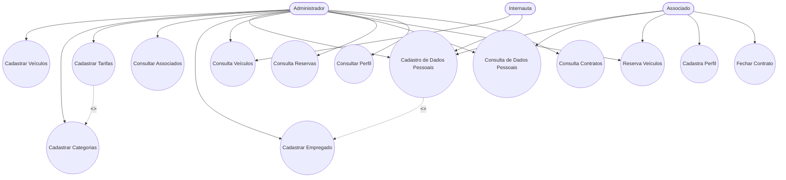
```mermaid
flowchart TB
    Administrador([Administrador])
    Internauta([Internauta])
    Associado([Associado])

    UC_CadastrarVeiculos(("Cadastrar Veículos"))
    UC_CadastrarCategorias(("Cadastrar Categorias"))
    UC_CadastrarTarifas(("Cadastrar Tarifas"))
    UC_ConsultarAssociados(("Consultar Associados"))
    UC_CadastrarEmpregado(("Cadastrar Empregado"))
    UC_CadastroDados(("Cadastro de Dados Pessoais"))
    UC_ConsultaVeiculos(("Consulta Veículos"))
    UC_ConsultaDados(("Consulta de Dados Pessoais"))
    UC_ReservaVeiculos(("Reserva Veículos"))
    UC_ConsultaReservas(("Consulta Reservas"))
    UC_ConsultarPerfil(("Consultar Perfil"))
    UC_CadastraPerfil(("Cadastra Perfil"))
    UC_ConsultaContratos(("Consulta Contratos"))
    UC_FecharContrato(("Fechar Contrato"))

    Administrador --> UC_CadastrarVeiculos
    Administrador --> UC_CadastrarCategorias
    Administrador --> UC_CadastrarTarifas
    Administrador --> UC_ConsultarAssociados
    Administrador --> UC_CadastrarEmpregado
    Administrador --> UC_CadastroDados
    Administrador --> UC_ConsultaVeiculos
    Administrador --> UC_ConsultaDados
    Administrador --> UC_ReservaVeiculos
    Administrador --> UC_ConsultaReservas
    Administrador --> UC_ConsultarPerfil
    Administrador --> UC_ConsultaContratos

    Internauta --> UC_ConsultaVeiculos
    Internauta --> UC_CadastroDados

    Associado --> UC_CadastroDados
    Associado --> UC_ConsultaDados
    Associado --> UC_ReservaVeiculos
    Associado --> UC_CadastraPerfil
    Associado --> UC_FecharContrato

    UC_CadastrarTarifas -.->|"<<extend>>"| UC_CadastrarCategorias
    UC_CadastroDados -.->|"<<extend>>"| UC_CadastrarEmpregado
```

### 1. Cadastro de Dados Pessoais

**Descrição:** responsável pelo cadastro de novos usuários, incluindo criação de login e cadastro dos dados pessoais.

**Atores:** Internauta, Associado e Administrador.

**Condição:** apenas administradores podem cadastrar usuários administrativos.

**Curso normal:**

1. Usuário solicita novo cadastro.
2. Sistema verifica o tipo de usuário.
3. Usuário preenche login, e-mail, senha e dados necessários.
4. Usuário preenche dados pessoais.
5. Sistema verifica se já existe cliente com o CPF informado.
6. Usuário confirma os dados.
7. Sistema informa que o cadastro foi efetuado.

**Cursos alternativos:**

- Se o usuário for administrador, o sistema disponibiliza a escolha do tipo de usuário.
- Se o usuário cancelar, o cadastro é interrompido.
- Se o e-mail já estiver cadastrado, o sistema informa a duplicidade.
- Se o CPF já estiver cadastrado, o sistema informa a duplicidade.

**Classes relacionadas:** `LoginDGS`, `Criptografia`, `Associado`, `Empregado`.

### 2. Consulta de Dados Pessoais

**Descrição:** consulta e alteração dos dados de usuários cadastrados.

**Atores:** Administrador e Associado.

**Condição:** o usuário deve estar logado.

**Curso normal:**

1. Usuário solicita visualizar seus dados pessoais.
2. Sistema verifica se o usuário está logado.
3. Sistema retorna os dados do usuário.
4. Sistema finaliza a operação.

**Cursos alternativos:**

- Se o usuário não estiver logado, o sistema informa que é necessário efetuar login.
- O usuário pode cancelar a consulta.
- O usuário pode marcar a opção de alteração; nesse caso, o sistema informa que os dados foram alterados.

**Classes relacionadas:** `Empregado`, `Associado`.

### 3. Consultar Associados

**Descrição:** consulta e alteração dos dados pessoais de associados cadastrados.

**Ator:** Administrador.

**Condição:** usuário deve estar logado.

**Curso normal:**

1. Empregado solicita consulta de dados pessoais.
2. Sistema disponibiliza opções de consulta por ID, nome, e-mail ou CPF.
3. Sistema retorna os dados ordenados pela opção escolhida.
4. Usuário solicita visualização do associado selecionado.

**Cursos alternativos:**

- Se nenhum dado for encontrado, o sistema informa que nenhum registro foi localizado.
- O sistema disponibiliza os dados completos do associado.
- O usuário pode alterar os dados do associado.
- O usuário pode cancelar a alteração.

**Classes relacionadas:** `Empregado`, `Associado`, `Contrato`.

### 4. Cadastrar Veículos

**Descrição:** cadastro, alteração e exclusão de veículos.

**Ator:** Empregado.

**Condição:** deve existir categoria cadastrada.

**Curso normal:**

1. Empregado solicita cadastrar veículo e informa a placa.
2. Sistema verifica se o veículo já está cadastrado.
3. Empregado informa os dados do veículo e confirma o cadastro.
4. Sistema informa que os dados foram cadastrados.

**Cursos alternativos:**

- Se o veículo já estiver cadastrado, o sistema oferece opções de alterar ou excluir.
- Na alteração, o sistema atualiza os dados e informa sucesso.
- Na exclusão, o sistema remove o veículo associado à placa e informa sucesso.
- O usuário pode cancelar o cadastro.

**Classes relacionadas:** `Empregado`, `Carro`, `Categoria`.

### 5. Consultar Veículos

**Descrição:** consulta de veículos disponíveis e seus respectivos preços.

**Atores:** Internauta, Associado e Administrador.

**Condição:** nenhuma.

**Curso normal:**

1. Usuário solicita consulta.
2. Sistema informa as consultas disponíveis.
3. Usuário escolhe o veículo desejado.
4. Sistema verifica se o usuário está logado.
5. Usuário solicita reserva.

**Cursos alternativos:**

- Consulta por veículos: retorna veículos e preços ordenados por categoria.
- Consulta por preços: retorna veículos e preços ordenados por preço.
- Consulta por categorias: retorna veículos e preços ordenados por categoria.
- Se o usuário não estiver logado, o sistema informa que deve se autenticar para continuar.

**Classes relacionadas:** `Carro`, `Categoria`, `Tarifas`, `Reserva`.

### 6. Reservar Veículos

**Descrição:** criação de nova reserva e consulta de veículos para reserva.

**Ator:** Associado.

**Condição:** associado deve estar cadastrado e sem pendências.

**Curso normal:**

1. Usuário solicita reserva de veículo.
2. Sistema verifica se já existe reserva cadastrada.
3. Sistema verifica o tipo de usuário.
4. Usuário informa local, data e hora de retirada e devolução.
5. Usuário consulta veículos e escolhe um veículo.
6. Sistema verifica se o veículo está disponível.
7. Usuário confirma a reserva.

**Cursos alternativos:**

- Se já existir reserva, o sistema informa que o usuário possui reserva cadastrada.
- Se o usuário for administrador, o sistema redireciona para a interface de consulta.
- Se o veículo não estiver disponível, o sistema informa o motivo.
- Se dados estiverem incorretos, o sistema informa ao usuário.
- Se houver pendência, o sistema solicita contato com a central.
- O cliente pode cancelar a reserva.

**Classes relacionadas:** `Associado`, `Reserva`, `Veiculo`.

### 7. Consultar Reservas

**Descrição:** consulta, alteração e exclusão de reservas cadastradas.

**Atores:** Empregado e Associado.

**Condição:** apenas empregados podem consultar reservas de outros usuários.

**Curso normal:**

1. Usuário solicita consulta de veículos reservados.
2. Sistema disponibiliza opções de consulta direta, por período ou por data.
3. Sistema retorna os dados da reserva.

**Cursos alternativos:**

- Consulta direta: usuário informa CPF, placa, modelo ou categoria.
- Se não houver reserva, o sistema informa que não existem reservas cadastradas.
- Consulta por período: usuário informa início e fim.
- Consulta por data: usuário informa a data.
- Usuário pode cancelar a consulta.

**Classes relacionadas:** `Empregado`, `Reserva`, `Carro`, `Categoria`.

### 8. Fechar Contrato

**Descrição:** fechamento de contrato, criação de cadastro do contrato e formas de pagamento.

**Ator:** Associado.

**Condição:** associado deve estar logado e possuir reserva cadastrada.

**Curso normal:**

1. Usuário solicita efetuar pagamento.
2. Sistema informa tipos de pagamento disponíveis.
3. Sistema valida o pagamento.
4. Sistema informa que o contrato foi feito com sucesso.

**Cursos alternativos:**

- Cartão de crédito: sistema valida o cartão.
- Se o cartão não for válido, o sistema informa a inconsistência.
- Boleto bancário: sistema disponibiliza boleto para impressão.
- Se o pagamento for comprovado, o sistema envia e-mail com comprovante.

**Classes relacionadas:** `Associado`, `Carro`, `Reserva`, `Contrato`.

### 9. Cadastro de Empregados

**Descrição:** cadastro, alteração e exclusão de empregados.

**Ator:** Administrador.

**Condição:** apenas empregados com perfil máster podem alterar ou excluir.

**Curso normal:**

1. Usuário solicita novo cadastro e informa CPF ou e-mail.
2. Sistema verifica se não existe cliente cadastrado.
3. Usuário informa seus dados e confirma o cadastro.
4. Sistema informa que o cadastro foi efetuado.

**Cursos alternativos:**

- Se o usuário já estiver cadastrado, o sistema oferece opções de alterar ou excluir.
- Na alteração, o sistema atualiza os dados e informa sucesso.
- Na exclusão, o sistema remove o usuário associado ao CPF e informa sucesso.
- O usuário pode cancelar o cadastro.

**Classe relacionada:** `Empregados`.

### 10. Cadastrar Tarifas

**Descrição:** cadastro, consulta, alteração e exclusão de tarifas.

**Ator:** Empregado.

**Condição:** nenhuma.

**Curso normal:**

1. Usuário solicita cadastrar tarifa.
2. Sistema verifica se a tarifa está cadastrada.
3. Usuário informa os dados da tarifa e confirma o cadastro.
4. Sistema informa que a tarifa foi cadastrada.

**Cursos alternativos:**

- Se a tarifa já estiver cadastrada, o sistema oferece opções de consultar, alterar ou excluir.
- Consulta: sistema exibe tarifas cadastradas.
- Alteração: sistema atualiza dados e informa sucesso.
- Exclusão: sistema remove a tarifa associada à placa do veículo e informa sucesso.
- Usuário pode cancelar o cadastro.

**Classes relacionadas:** `Empregado`, `Tarifa`.

### 11. Consultar Contrato

**Descrição:** consulta de contratos fechados.

**Ator:** Empregado.

**Condição:** nenhuma.

**Curso normal:**

1. Empregado solicita consulta de contratos.
2. Sistema disponibiliza opções de consulta direta, por situação ou por período.
3. Sistema retorna os dados da consulta.

**Cursos alternativos:**

- Consulta direta: empregado informa código do contrato, placa do veículo ou CPF do associado.
- Consulta por situação: empregado informa se o contrato está em análise, contratado ou concluído.
- Consulta por período: empregado informa início e fim do período.
- Usuário pode cancelar a consulta.

**Classes relacionadas:** `Contrato`, `Carro`, `Categoria`, `Associados`, `Empregado`.

### 12. Cadastrar Perfil

**Descrição:** cadastro do perfil do associado para apoio à oferta de veículos e promoções.

**Ator:** Associado.

**Condição:** associado deve estar cadastrado no sistema.

**Curso normal:**

1. Usuário efetua login.
2. Sistema verifica se o perfil está cadastrado.
3. Sistema oferece veículos e promoções.

**Curso alternativo:**

- Se o perfil não estiver cadastrado, o sistema informa a ausência do perfil e disponibiliza questionário para preenchimento.

**Classes relacionadas:** `Associado`, `Carro`, `Tarifas`.

## Diagrama de Classes

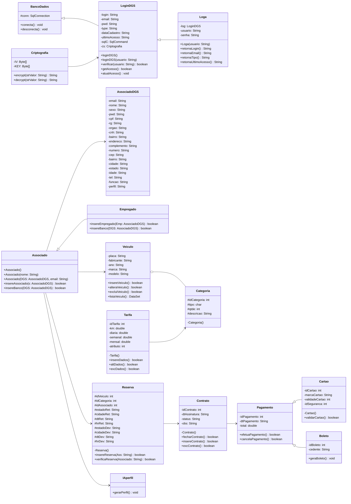
```mermaid
classDiagram
    direction LR

    class BancoDados {
        +conecta() void
        +desconecta() void
        #conn: SqlConnection
    }

    class Criptografia {
        -IV: Byte[]
        -KEY: Byte[]
        +encrypt(strValor: String) String
        +decrypt(strValor: String) String
    }

    class LoginDGS {
        -login: String
        -email: String
        -pwd: String
        -type: String
        -dataCadastro: String
        -ultimoAcesso: String
        -sqlC: SqlCommand
        -cs: Criptografia
        +loginDGS()
        +loginDGS(usuario: String)
        +verificar(usuario: String) boolean
        +getAcesso() boolean
        +atualAcesso() void
    }

    class Loga {
        -log: LoginDGS
        -usuario: String
        -senha: String
        +Loga(usuario: String)
        +retornaLogin() String
        +retornaEmail() String
        +retornaTipo() String
        +retornaUltimoAcesso() String
    }

    class Associado {
        +Associado()
        +Associado(nome: String)
        +Associado(DGS: AssociadoDGS, email: String)
        +insereAssociado(s: AssociadoDGS) boolean
        +insereBanco(DGS: AssociadoDGS) boolean
    }

    class AssociadoDGS {
        -email: String
        -nome: String
        -sexo: String
        -pwd: String
        -cpf: String
        -rg: String
        -orgao: String
        -cnh: String
        -bairro: String
        -endereco: String
        -complemento: String
        -numero: String
        -cep: String
        -bairro: String
        -cidade: String
        -estado: String
        -idade: String
        -tel: String
        -funcao: String
        -perfil: String
    }

    class Empregado {
        +insereEmpregado(Emp: AssociadoDGS) boolean
        +insereBanco(DGS: AssociadoDGS) boolean
    }

    class Veiculo {
        -placa: String
        -fabricante: String
        -ano: String
        -marca: String
        -modelo: String
        +insereVeiculo() boolean
        +alteraVeiculo() boolean
        +excluiVeiculo() boolean
        +listaVeiculo() DataSet
    }

    class Categoria {
        #idCategoria: int
        #tipo: char
        #qtde: int
        #descricao: String
        -Categoria()
    }

    class Tarifa {
        -idTarifa: int
        -km: double
        -diaria: double
        -semanal: double
        -mensal: double
        -atributo: int
        -Tarifa()
        +insereDados() boolean
        +altDados() boolean
        +excDados() boolean
    }

    class Reserva {
        #idVeiculo: int
        #idCategoria: int
        #idAssociado: int
        #estadoRet: String
        #cidadeRet: String
        #dtRet: String
        #hrRet: String
        #estadoDev: String
        #cidadeDev: String
        #dtDev: String
        #hrDev: String
        -Reserva()
        +insereReserva(Ass: String) boolean
        +verificaReserva(Associado: String) boolean
    }

    class Contrato {
        -idContrato: int
        -dtAssinatura: String
        -status: String
        -obs: String
        -Contrato()
        +fecharContrato() boolean
        +insereContrato() boolean
        +excContrato() boolean
    }

    class Pagamento {
        -idPagamento: int
        -dtPagamento: String
        -total: double
        +efetuaPagamento() boolean
        +cancelaPagamento() boolean
    }

    class Cartao {
        -idCartao: int
        -marcaCartao: String
        -validadeCartao: int
        -idSeguranca: int
        -Cartao()
        +validarCartao() boolean
    }

    class Boleto {
        -idBoleto: int
        -cedente: String
        +geraBoleto() void
    }

    class IAperfil {
        +gerarPerfil() void
    }

    BancoDados <|-- LoginDGS
    LoginDGS <|-- Loga
    Criptografia --> LoginDGS
    Associado <|-- Empregado
    Associado --> AssociadoDGS
    Associado --> IAperfil
    Associado --> Reserva
    Associado --> Veiculo
    Veiculo o-- Categoria
    Tarifa --> Categoria
    Reserva --> Contrato
    Pagamento <|-- Cartao
    Pagamento <|-- Boleto
    Contrato --> Pagamento
```

## Diagramas de Sequência

### Cadastro de Dados Pessoais

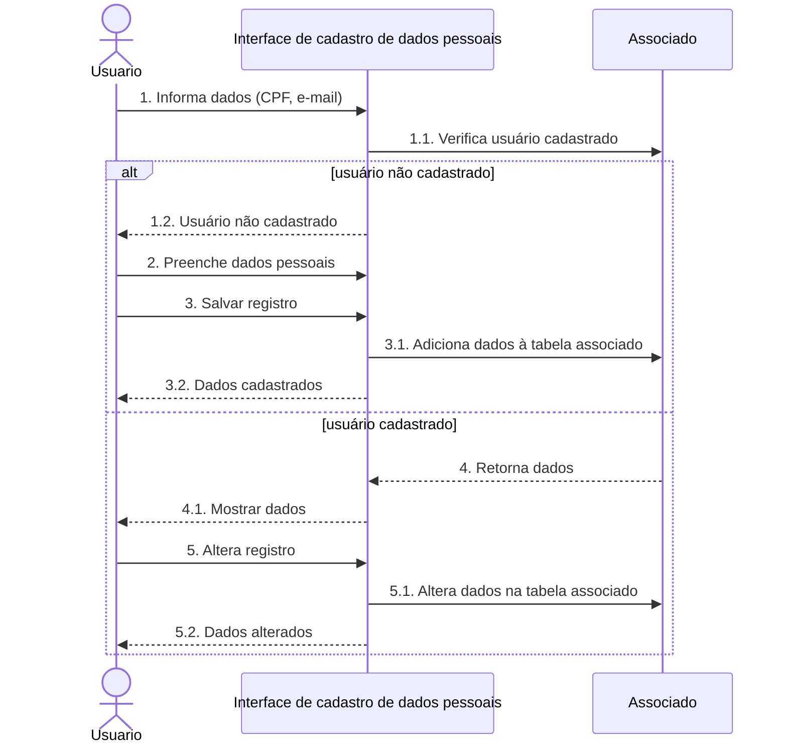
```mermaid
sequenceDiagram
    actor Usuario
    participant Interface as Interface de cadastro de dados pessoais
    participant Associado

    Usuario->>Interface: 1. Informa dados (CPF, e-mail)
    Interface->>Associado: 1.1. Verifica usuário cadastrado
    alt usuário não cadastrado
        Interface-->>Usuario: 1.2. Usuário não cadastrado
        Usuario->>Interface: 2. Preenche dados pessoais
        Usuario->>Interface: 3. Salvar registro
        Interface->>Associado: 3.1. Adiciona dados à tabela associado
        Interface-->>Usuario: 3.2. Dados cadastrados
    else usuário cadastrado
        Associado-->>Interface: 4. Retorna dados
        Interface-->>Usuario: 4.1. Mostrar dados
        Usuario->>Interface: 5. Altera registro
        Interface->>Associado: 5.1. Altera dados na tabela associado
        Interface-->>Usuario: 5.2. Dados alterados
    end
```

### Consulta de Dados Pessoais

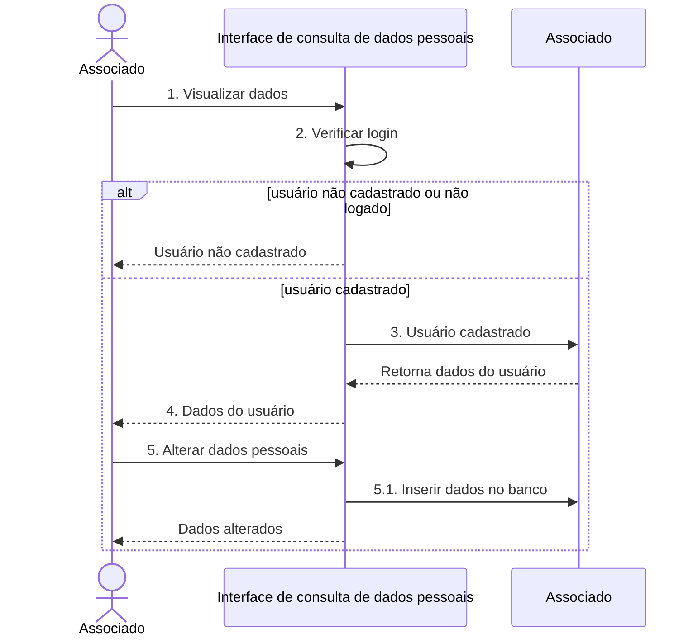
```mermaid
sequenceDiagram
    actor AssociadoAtor as Associado
    participant Interface as Interface de consulta de dados pessoais
    participant Associado

    AssociadoAtor->>Interface: 1. Visualizar dados
    Interface->>Interface: 2. Verificar login
    alt usuário não cadastrado ou não logado
        Interface-->>AssociadoAtor: Usuário não cadastrado
    else usuário cadastrado
        Interface->>Associado: 3. Usuário cadastrado
        Associado-->>Interface: Retorna dados do usuário
        Interface-->>AssociadoAtor: 4. Dados do usuário
        AssociadoAtor->>Interface: 5. Alterar dados pessoais
        Interface->>Associado: 5.1. Inserir dados no banco
        Interface-->>AssociadoAtor: Dados alterados
    end
```

### Consulta de Associados

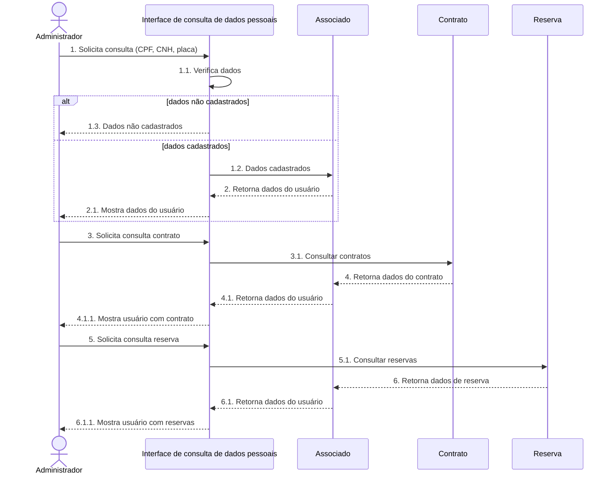
```mermaid
sequenceDiagram
    actor Administrador
    participant Interface as Interface de consulta de dados pessoais
    participant Associado
    participant Contrato
    participant Reserva

    Administrador->>Interface: 1. Solicita consulta (CPF, CNH, placa)
    Interface->>Interface: 1.1. Verifica dados
    alt dados não cadastrados
        Interface-->>Administrador: 1.3. Dados não cadastrados
    else dados cadastrados
        Interface->>Associado: 1.2. Dados cadastrados
        Associado-->>Interface: 2. Retorna dados do usuário
        Interface-->>Administrador: 2.1. Mostra dados do usuário
    end

    Administrador->>Interface: 3. Solicita consulta contrato
    Interface->>Contrato: 3.1. Consultar contratos
    Contrato-->>Associado: 4. Retorna dados do contrato
    Associado-->>Interface: 4.1. Retorna dados do usuário
    Interface-->>Administrador: 4.1.1. Mostra usuário com contrato

    Administrador->>Interface: 5. Solicita consulta reserva
    Interface->>Reserva: 5.1. Consultar reservas
    Reserva-->>Associado: 6. Retorna dados de reserva
    Associado-->>Interface: 6.1. Retorna dados do usuário
    Interface-->>Administrador: 6.1.1. Mostra usuário com reservas
```

### Cadastrar Veículos

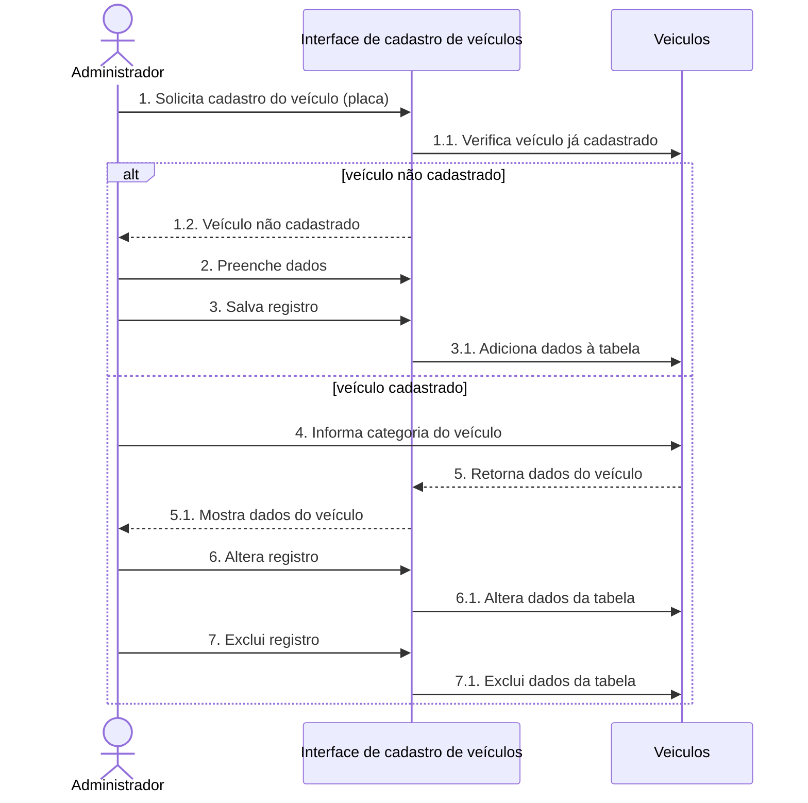
```mermaid
sequenceDiagram
    actor Administrador
    participant Interface as Interface de cadastro de veículos
    participant Veiculos

    Administrador->>Interface: 1. Solicita cadastro do veículo (placa)
    Interface->>Veiculos: 1.1. Verifica veículo já cadastrado
    alt veículo não cadastrado
        Interface-->>Administrador: 1.2. Veículo não cadastrado
        Administrador->>Interface: 2. Preenche dados
        Administrador->>Interface: 3. Salva registro
        Interface->>Veiculos: 3.1. Adiciona dados à tabela
    else veículo cadastrado
        Administrador->>Veiculos: 4. Informa categoria do veículo
        Veiculos-->>Interface: 5. Retorna dados do veículo
        Interface-->>Administrador: 5.1. Mostra dados do veículo
        Administrador->>Interface: 6. Altera registro
        Interface->>Veiculos: 6.1. Altera dados da tabela
        Administrador->>Interface: 7. Exclui registro
        Interface->>Veiculos: 7.1. Exclui dados da tabela
    end
```

### Consultar Veículos

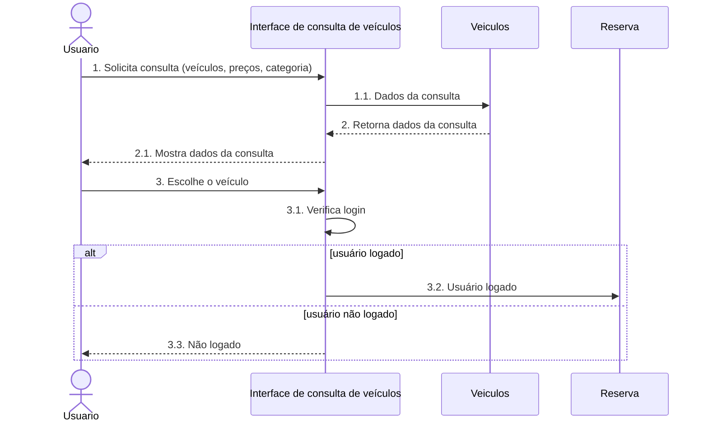
```mermaid
sequenceDiagram
    actor Usuario
    participant Interface as Interface de consulta de veículos
    participant Veiculos
    participant Reserva

    Usuario->>Interface: 1. Solicita consulta (veículos, preços, categoria)
    Interface->>Veiculos: 1.1. Dados da consulta
    Veiculos-->>Interface: 2. Retorna dados da consulta
    Interface-->>Usuario: 2.1. Mostra dados da consulta
    Usuario->>Interface: 3. Escolhe o veículo
    Interface->>Interface: 3.1. Verifica login
    alt usuário logado
        Interface->>Reserva: 3.2. Usuário logado
    else usuário não logado
        Interface-->>Usuario: 3.3. Não logado
    end
```

### Reservar Veículos

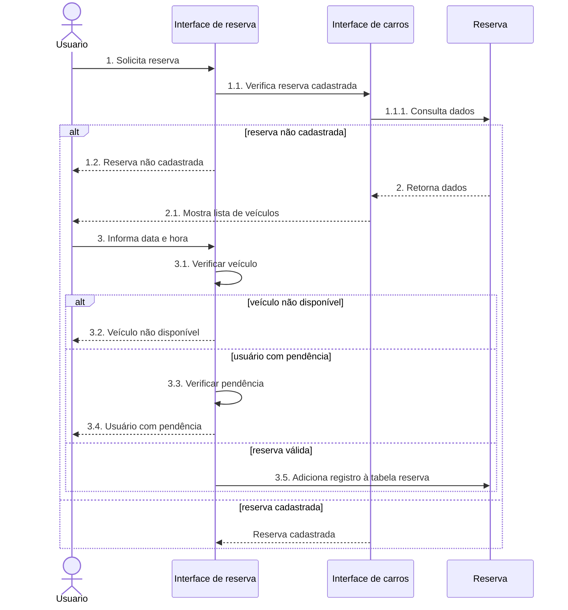
```mermaid
sequenceDiagram
    actor Usuario
    participant InterfaceReserva as Interface de reserva
    participant InterfaceCarros as Interface de carros
    participant Reserva

    Usuario->>InterfaceReserva: 1. Solicita reserva
    InterfaceReserva->>InterfaceCarros: 1.1. Verifica reserva cadastrada
    InterfaceCarros->>Reserva: 1.1.1. Consulta dados
    alt reserva não cadastrada
        InterfaceReserva-->>Usuario: 1.2. Reserva não cadastrada
        Reserva-->>InterfaceCarros: 2. Retorna dados
        InterfaceCarros-->>Usuario: 2.1. Mostra lista de veículos
        Usuario->>InterfaceReserva: 3. Informa data e hora
        InterfaceReserva->>InterfaceReserva: 3.1. Verificar veículo
        alt veículo não disponível
            InterfaceReserva-->>Usuario: 3.2. Veículo não disponível
        else usuário com pendência
            InterfaceReserva->>InterfaceReserva: 3.3. Verificar pendência
            InterfaceReserva-->>Usuario: 3.4. Usuário com pendência
        else reserva válida
            InterfaceReserva->>Reserva: 3.5. Adiciona registro à tabela reserva
        end
    else reserva cadastrada
        InterfaceCarros-->>InterfaceReserva: Reserva cadastrada
    end
```

### Consultar Reservas

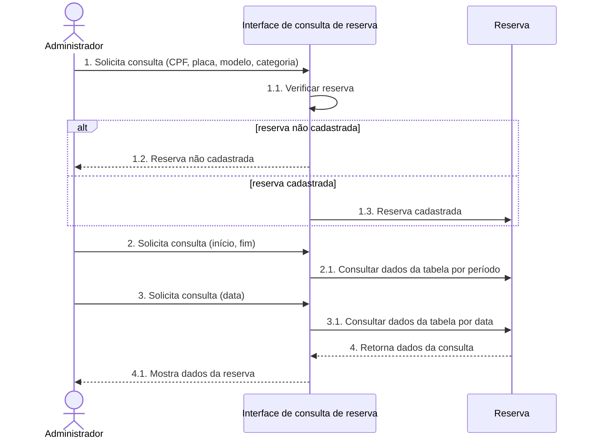
```mermaid
sequenceDiagram
    actor Administrador
    participant Interface as Interface de consulta de reserva
    participant Reserva

    Administrador->>Interface: 1. Solicita consulta (CPF, placa, modelo, categoria)
    Interface->>Interface: 1.1. Verificar reserva
    alt reserva não cadastrada
        Interface-->>Administrador: 1.2. Reserva não cadastrada
    else reserva cadastrada
        Interface->>Reserva: 1.3. Reserva cadastrada
    end

    Administrador->>Interface: 2. Solicita consulta (início, fim)
    Interface->>Reserva: 2.1. Consultar dados da tabela por período
    Administrador->>Interface: 3. Solicita consulta (data)
    Interface->>Reserva: 3.1. Consultar dados da tabela por data
    Reserva-->>Interface: 4. Retorna dados da consulta
    Interface-->>Administrador: 4.1. Mostra dados da reserva
```

### Fechar Contrato

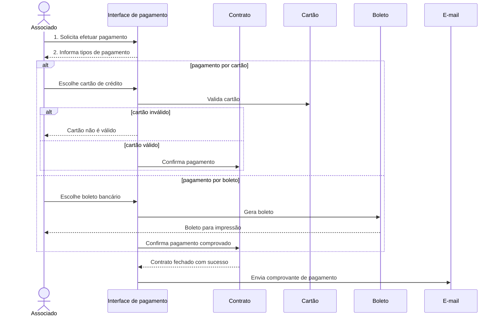
```mermaid
sequenceDiagram
    actor Associado
    participant Interface as Interface de pagamento
    participant Contrato
    participant Cartao as Cartão
    participant Boleto
    participant Email as E-mail

    Associado->>Interface: 1. Solicita efetuar pagamento
    Interface-->>Associado: 2. Informa tipos de pagamento
    alt pagamento por cartão
        Associado->>Interface: Escolhe cartão de crédito
        Interface->>Cartao: Valida cartão
        alt cartão inválido
            Interface-->>Associado: Cartão não é válido
        else cartão válido
            Interface->>Contrato: Confirma pagamento
        end
    else pagamento por boleto
        Associado->>Interface: Escolhe boleto bancário
        Interface->>Boleto: Gera boleto
        Boleto-->>Associado: Boleto para impressão
        Interface->>Contrato: Confirma pagamento comprovado
    end
    Contrato-->>Interface: Contrato fechado com sucesso
    Interface->>Email: Envia comprovante de pagamento
```

### Cadastro de Empregados

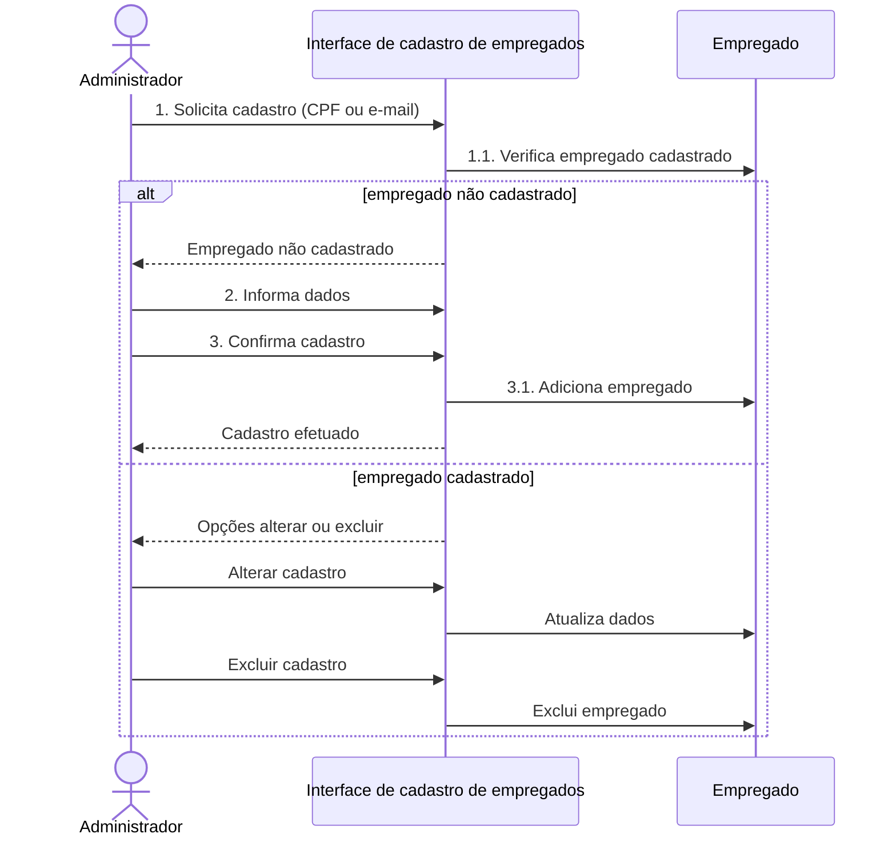
```mermaid
sequenceDiagram
    actor Administrador
    participant Interface as Interface de cadastro de empregados
    participant Empregado

    Administrador->>Interface: 1. Solicita cadastro (CPF ou e-mail)
    Interface->>Empregado: 1.1. Verifica empregado cadastrado
    alt empregado não cadastrado
        Interface-->>Administrador: Empregado não cadastrado
        Administrador->>Interface: 2. Informa dados
        Administrador->>Interface: 3. Confirma cadastro
        Interface->>Empregado: 3.1. Adiciona empregado
        Interface-->>Administrador: Cadastro efetuado
    else empregado cadastrado
        Interface-->>Administrador: Opções alterar ou excluir
        Administrador->>Interface: Alterar cadastro
        Interface->>Empregado: Atualiza dados
        Administrador->>Interface: Excluir cadastro
        Interface->>Empregado: Exclui empregado
    end
```

### Cadastrar Tarifas

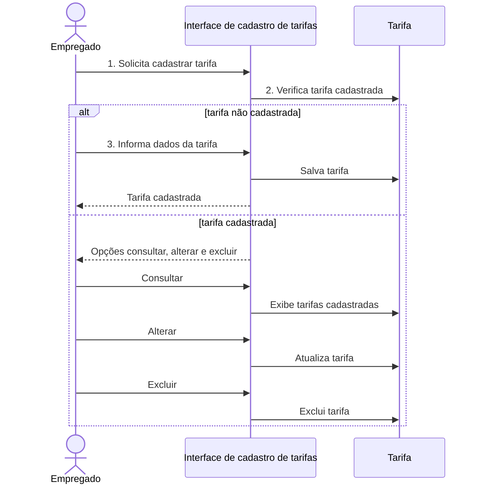
```mermaid
sequenceDiagram
    actor EmpregadoAtor as Empregado
    participant Interface as Interface de cadastro de tarifas
    participant Tarifa

    EmpregadoAtor->>Interface: 1. Solicita cadastrar tarifa
    Interface->>Tarifa: 2. Verifica tarifa cadastrada
    alt tarifa não cadastrada
        EmpregadoAtor->>Interface: 3. Informa dados da tarifa
        Interface->>Tarifa: Salva tarifa
        Interface-->>EmpregadoAtor: Tarifa cadastrada
    else tarifa cadastrada
        Interface-->>EmpregadoAtor: Opções consultar, alterar e excluir
        EmpregadoAtor->>Interface: Consultar
        Interface->>Tarifa: Exibe tarifas cadastradas
        EmpregadoAtor->>Interface: Alterar
        Interface->>Tarifa: Atualiza tarifa
        EmpregadoAtor->>Interface: Excluir
        Interface->>Tarifa: Exclui tarifa
    end
```

### Consultar Contrato

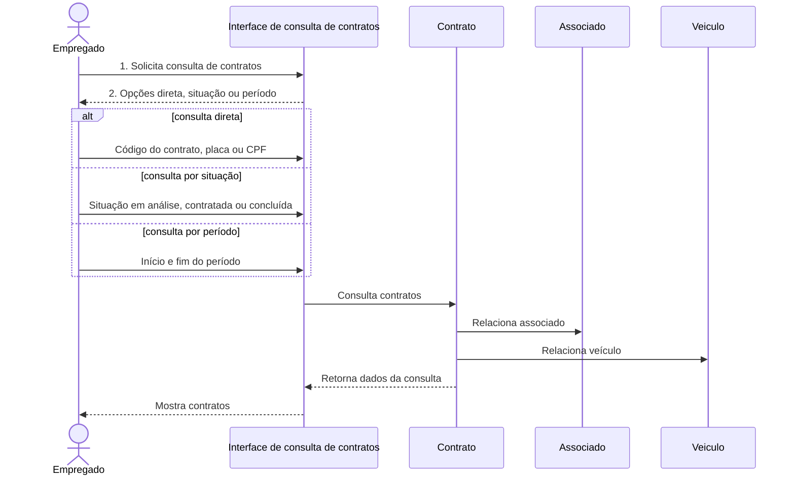
```mermaid
sequenceDiagram
    actor EmpregadoAtor as Empregado
    participant Interface as Interface de consulta de contratos
    participant Contrato
    participant Associado
    participant Veiculo

    EmpregadoAtor->>Interface: 1. Solicita consulta de contratos
    Interface-->>EmpregadoAtor: 2. Opções direta, situação ou período
    alt consulta direta
        EmpregadoAtor->>Interface: Código do contrato, placa ou CPF
    else consulta por situação
        EmpregadoAtor->>Interface: Situação em análise, contratada ou concluída
    else consulta por período
        EmpregadoAtor->>Interface: Início e fim do período
    end
    Interface->>Contrato: Consulta contratos
    Contrato->>Associado: Relaciona associado
    Contrato->>Veiculo: Relaciona veículo
    Contrato-->>Interface: Retorna dados da consulta
    Interface-->>EmpregadoAtor: Mostra contratos
```

### Cadastrar Perfil

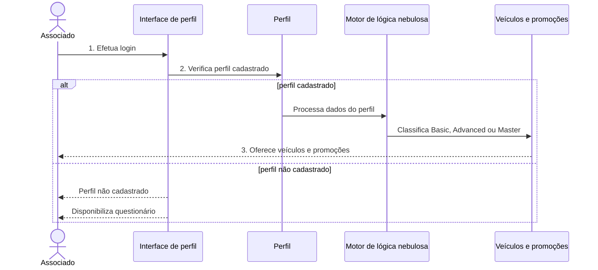
```mermaid
sequenceDiagram
    actor AssociadoAtor as Associado
    participant Interface as Interface de perfil
    participant Perfil
    participant Fuzzy as Motor de lógica nebulosa
    participant Oferta as Veículos e promoções

    AssociadoAtor->>Interface: 1. Efetua login
    Interface->>Perfil: 2. Verifica perfil cadastrado
    alt perfil cadastrado
        Perfil->>Fuzzy: Processa dados do perfil
        Fuzzy->>Oferta: Classifica Basic, Advanced ou Master
        Oferta-->>AssociadoAtor: 3. Oferece veículos e promoções
    else perfil não cadastrado
        Interface-->>AssociadoAtor: Perfil não cadastrado
        Interface-->>AssociadoAtor: Disponibiliza questionário
    end
```

## Diagrama de Atividade

O diagrama de atividade descreve o fluxo de aluguel sem necessidade de comparecimento físico à locadora.

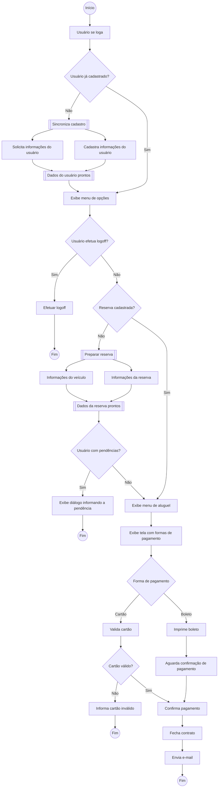
```mermaid
flowchart TD
    Inicio((Início)) --> Login[Usuário se loga]
    Login --> Cadastro{Usuário já cadastrado?}

    Cadastro -- Não --> ForkCadastro[[Sincroniza cadastro]]
    ForkCadastro --> SolicitaInfo[Solicita informações do usuário]
    ForkCadastro --> CadastraInfo[Cadastra informações do usuário]
    SolicitaInfo --> JoinCadastro[[Dados do usuário prontos]]
    CadastraInfo --> JoinCadastro
    JoinCadastro --> Menu[Exibe menu de opções]

    Cadastro -- Sim --> Menu
    Menu --> Logoff{Usuário efetua logoff?}
    Logoff -- Sim --> EfetuarLogoff[Efetuar logoff] --> FimLogoff((Fim))
    Logoff -- Não --> Reserva{Reserva cadastrada?}

    Reserva -- Não --> ForkReserva[[Preparar reserva]]
    ForkReserva --> InfoVeiculo[Informações do veículo]
    ForkReserva --> InfoReserva[Informações da reserva]
    InfoVeiculo --> JoinReserva[[Dados da reserva prontos]]
    InfoReserva --> JoinReserva
    JoinReserva --> Pendencia{Usuário com pendências?}
    Pendencia -- Sim --> DialogoPendencia[Exibe diálogo informando a pendência] --> FimPendencia((Fim))
    Pendencia -- Não --> MenuAluguel[Exibe menu de aluguel]

    Reserva -- Sim --> MenuAluguel
    MenuAluguel --> FormasPagamento[Exibe tela com formas de pagamento]
    FormasPagamento --> TipoPagamento{Forma de pagamento}

    TipoPagamento -- Cartão --> ValidaCartao[Valida cartão]
    ValidaCartao --> CartaoValido{Cartão válido?}
    CartaoValido -- Não --> InformaCartao[Informa cartão inválido] --> FimCartao((Fim))
    CartaoValido -- Sim --> ConfirmaPagamento[Confirma pagamento]

    TipoPagamento -- Boleto --> ImprimeBoleto[Imprime boleto]
    ImprimeBoleto --> AguardaPagamento[Aguarda confirmação de pagamento]
    AguardaPagamento --> ConfirmaPagamento

    ConfirmaPagamento --> FechaContrato[Fecha contrato]
    FechaContrato --> EnviaEmail[Envia e-mail]
    EnviaEmail --> FimContrato((Fim))
```

## Diagrama de Implantação

O sistema é descrito como cliente-servidor, com banco de dados centralizado contendo os registros acessados por usuários e empregados.

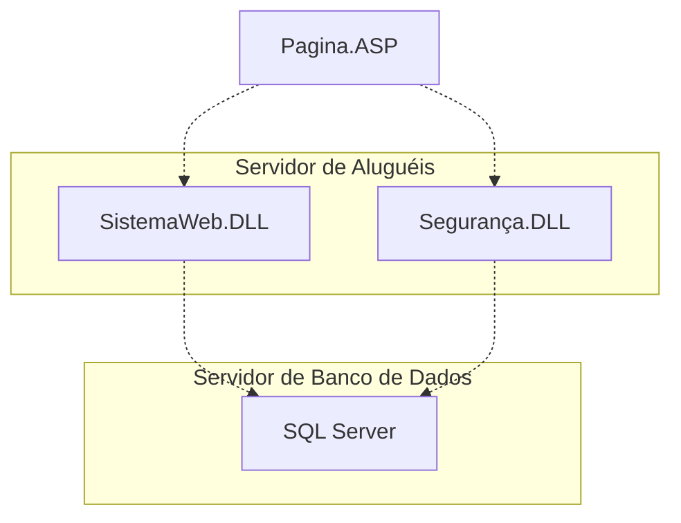
```mermaid
flowchart TB
    PaginaASP[Pagina.ASP]

    subgraph ServidorAlugueis["Servidor de Aluguéis"]
        SistemaWeb["SistemaWeb.DLL"]
        Seguranca["Segurança.DLL"]
    end

    subgraph ServidorBD["Servidor de Banco de Dados"]
        SQLServer["SQL Server"]
    end

    PaginaASP -.-> SistemaWeb
    PaginaASP -.-> Seguranca
    SistemaWeb -.-> SQLServer
    Seguranca -.-> SQLServer
```

## Lógica Nebulosa

### Definição

A lógica nebulosa, também chamada de lógica difusa, generaliza a lógica booleana e permite valores intermediários entre verdadeiro e falso. No projeto, ela é usada para tratar incertezas no perfil do cliente e auxiliar a oferta de veículos e promoções.

### Objetivo no SIGACAR

Cada associado deve cadastrar seu perfil por meio de um questionário. Algumas respostas, combinadas aos dados já cadastrados, são transformadas em variáveis de entrada para o processo de fuzzificação.

O perfil do associado pode ser classificado como:

- `Basic`;
- `Advanced`;
- `Master`.

### Arquitetura Funcional de um Sistema Nebuloso

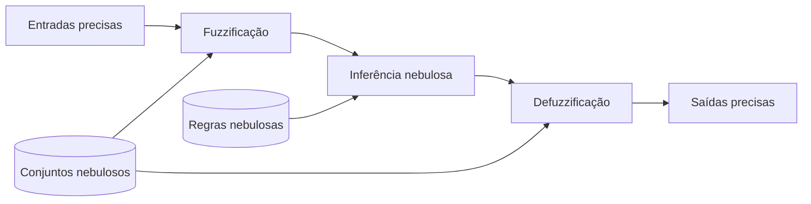
```mermaid
flowchart LR
    Entrada[Entradas precisas]
    Fuzzificacao[Fuzzificação]
    Conjuntos[(Conjuntos nebulosos)]
    Regras[(Regras nebulosas)]
    Inferencia[Inferência nebulosa]
    Defuzzificacao[Defuzzificação]
    Saida[Saídas precisas]

    Entrada --> Fuzzificacao
    Conjuntos --> Fuzzificacao
    Fuzzificacao --> Inferencia
    Regras --> Inferencia
    Inferencia --> Defuzzificacao
    Conjuntos --> Defuzzificacao
    Defuzzificacao --> Saida
```

### Conjuntos Nebulosos

#### Idade

| Faixa | 16 a 20 | 20 a 29 | 30 a 39 | 40 a 49 | 50 a 59 | 60 a 69 | 70 a +70 |
| --- | ---: | ---: | ---: | ---: | ---: | ---: | ---: |
| Muito jovem | 0,8 | 0,65 | 0,3 | 0,2 | 0,15 | 0,1 | 0,1 |
| Jovem | 0,6 | 0,45 | 0,65 | 0,35 | 0,25 | 0,2 | 0,1 |
| Adulto | 0,1 | 0,2 | 0,45 | 0,75 | 0,8 | 0,65 | 0,3 |
| Idoso | 0,1 | 0,1 | 0,2 | 0,2 | 0,3 | 0,45 | 0,7 |

#### Salário

| Faixa | 190 | 380 | 760 | 1200 | 1900 | 2500 | 3800 a +3800 |
| --- | ---: | ---: | ---: | ---: | ---: | ---: | ---: |
| Baixo | 0,8 | 0,7 | 0,65 | 0,3 | 0,2 | 0,15 | 0,1 |
| Médio | 0,3 | 0,4 | 0,45 | 0,7 | 0,8 | 0,2 | 0,1 |
| Alto | 0,1 | 0,2 | 0,3 | 0,4 | 0,5 | 0,65 | 0,9 |

#### Carteira

| Faixa | 1/2 a 1 | 1 a 5 | 5 a 10 | 10 a 15 | 15 a 20 | 20 a 25 | 25 a +25 |
| --- | ---: | ---: | ---: | ---: | ---: | ---: | ---: |
| Baixo risco | 0,1 | 0,2 | 0,3 | 0,3 | 0,15 | 0,45 | 0,8 |
| Médio risco | 0,2 | 0,45 | 0,5 | 0,55 | 0,45 | 0,35 | 0,2 |
| Alto risco | 1,0 | 0,65 | 0,4 | 0,25 | 0,2 | 0,15 | 0,1 |

#### Perfil

| Faixa | 0 | 200 | 500 | 1000 | 1200 | 2000 a +2000 |
| --- | ---: | ---: | ---: | ---: | ---: | ---: |
| Basic | 1,0 | 0,8 | 0,65 | 0,25 | 0,1 | 0,1 |
| Advanced | 0,1 | 0,2 | 0,45 | 0,75 | 0,85 | 0,2 |
| Master | 0,1 | 0,1 | 0,1 | 0,15 | 0,25 | 0,9 |

### Fuzzificação do Exemplo

O documento usa como exemplo o usuário **Pedro de Assis Motta**, com:

- idade: 28 anos;
- salário: R$ 1.440,00;
- experiência na carteira de motorista: 10 anos.

Graus de pertinência:

| Variável | Conjunto | Grau |
| --- | --- | ---: |
| Idade | Jovem | 0,45 |
| Idade | Adulto | 0,2 |
| Idade | Idoso | 0,1 |
| Salário | Menos de dois salários mínimos | 0,2 |
| Salário | De dois a cinco salários mínimos | 0,6 |
| Salário | De cinco a dez salários mínimos | 0,4 |
| Carteira | Baixo risco | 0,65 |
| Carteira | Médio risco | 0,65 |
| Carteira | Alto risco | 0,35 |

### Regras Nebulosas

| Regra | Condição | Resultado |
| --- | --- | --- |
| R1 | Idade muito jovem, salário de um a três salários mínimos e carteira de alto risco | Perfil Basic |
| R2 | Idade muito jovem, salário até dez salários mínimos e carteira de baixo risco | Perfil Advanced |
| R3 | Idade muito jovem, salário maior que dez salários mínimos e carteira de médio risco | Perfil Master |
| R4 | Idade jovem, salário de dois a cinco salários mínimos e carteira de alto risco | Perfil Basic |
| R5 | Idade jovem, salário de cinco a dez salários mínimos e carteira de baixo risco | Perfil Advanced |
| R6 | Idade jovem, salário maior que dez salários mínimos e carteira de médio risco | Perfil Master |
| R7 | Idade adulta, salário de dois a cinco salários mínimos e carteira de alto risco | Perfil Advanced |
| R8 | Idade adulta, salário de cinco a dez salários mínimos e carteira de baixo risco | Perfil Advanced |
| R9 | Idade adulta, salário maior que dez salários mínimos e carteira de médio risco | Perfil Advanced |
| R10 | Idade idosa, salário de dois a cinco salários mínimos e carteira de alto risco | Perfil Advanced |
| R11 | Idade idosa, salário de cinco a dez salários mínimos e carteira de baixo risco | Perfil Advanced |
| R12 | Idade idosa, salário maior que dez salários mínimos e carteira de médio risco | Perfil Advanced |

### Defuzzificação do Exemplo

O documento apresenta três regras disparadas no exemplo:

| Regra | Cálculo do grau de disparo | Resultado |
| --- | --- | --- |
| Regra 1 | `min(0,45; 0,2; 0,35) = 0,2` | Perfil Basic com pertinência 0,2 |
| Regra 2 | `min(0,1; 0,6; 0,65) = 0,1` | Perfil Advanced com pertinência 0,1 |
| Regra 3 | `min(0,2; 0,4; 0,35) = 0,2` | Perfil Master com pertinência 0,2 |

Valores finais usados:

- `µBasic(X) = 0,2`, com `X = 850`;
- `µAdvanced(Y) = 0,1`, com `Y = 0`;
- `µMaster(Z) = 0,2`, com `Z = 900`.

Cálculo:

```text
Perfil = ((0,2 * 850) + (0,1 * 0) + (0,2 * 900)) / (0,2 + 0,1 + 0,3)
Perfil = 530 pontos
```

Assim, pelo sistema nebuloso do documento, um associado com 28 anos, salário de R$ 1.440,00 e 10 anos de carteira deve obter **530 pontos** como saída precisa.

## Implementação

### Visão Geral

O protótipo foi desenvolvido com arquitetura cliente-servidor em três camadas. Essa arquitetura busca:

- separar interface, lógica e dados;
- facilitar escalabilidade;
- tornar a base de dados mais independente;
- permitir desenvolvimento de interfaces gráficas mais amigáveis;
- reduzir necessidade de recursos excessivos nos servidores.

### Tecnologias Utilizadas

| Tecnologia | Papel no projeto |
| --- | --- |
| .NET Framework | Plataforma Microsoft para desenvolvimento e execução de aplicações web. |
| ASP.NET | Parte da plataforma .NET usada para criação de páginas e componentes web. |
| C# | Linguagem utilizada para criar componentes do .NET Framework e implementar regras do sistema. |
| AJAX | Técnica para execução de código sem recarregar páginas, reduzindo postbacks e reloads. |
| SQL Server 2000 | Sistema gerenciador de banco de dados usado para persistência centralizada. |

Elementos do .NET Framework citados:

- CLR;
- Metadata;
- Assemblies;
- linguagens habilitadas ao .NET;
- Common Type System;
- interoperabilidade entre linguagens;
- Web Services;
- servidores .NET;
- ADO.NET.

## Telas do Sistema

O documento descreve as principais telas do protótipo:

| Figura | Tela | Função |
| --- | --- | --- |
| 5.3.1 | Tela principal de entrada do website | Permite solicitar senha, realizar novo cadastro como associado e acessar funções iniciais. |
| 5.3.2 | Login do administrador | Tela de autenticação com opção de tipo de usuário para administradores. |
| 5.3.3 | Login comum | Tela de autenticação sem opção administrativa de tipo de usuário. |
| 5.3.4 | Cadastro e consulta de dados pessoais | Permite cadastrar e consultar dados pessoais; a consulta exibe opção de alteração. |
| 5.3.5 | Consulta de associados | Permite pesquisar e ordenar usuários por ID, nome, e-mail ou CPF. |
| 5.3.6 | Visualização completa de associado | Exibe dados completos do associado e permite alteração por administradores. |
| 5.3.7 | Consulta de veículos | Permite pesquisar e ordenar veículos por placa, preço e categoria. |
| 5.3.8 | Visualização completa de veículo | Exibe dados completos do veículo e permite alteração por administradores. |
| 5.3.9 | Cadastro de reservas | Interface para criação de reserva de veículo. |

## Conclusão

O projeto utilizou UML para descrever processos, classes e interações do sistema. O protótipo atende requisitos mínimos para funcionamento de uma locadora de automóveis on-line, incluindo cadastro, consulta, reserva, pagamento e fechamento de contratos.

A lógica nebulosa foi incorporada para lidar com situações incertas e classificar o perfil do associado, apoiando a oferta de produtos e promoções conforme características do cliente.

O sistema proposto busca oferecer diversidade de informações sobre veículos, segurança, confiabilidade, rapidez e comodidade, contribuindo para um atendimento mais eficiente.

## Referências

Referências bibliográficas citadas no documento original:

- BOJADZIEV E BOJADZIEV. *Lógica Nebulosa e Sistemas Nebulosos*, 1997.
- CEZAR, Cláudio. *Apostila de UML*. Rio de Janeiro, 2000.
- FOWLER, Martin; SCOTT, Kendall. *UML Essencial*. 2ª ed. São Paulo: Bookman, 2000.
- FURLAN, J. D. *Modelagem de objetos através da UML*. São Paulo: Market Books, 1999.
- GEORGE J. KLIR; BO YUAN. *Fuzzy Sets and Fuzzy Logic: Theory and Applications*. Prentice Hall PTR, 1995.
- LARMAN, C. *Utilizando UML e Padrões*. São Paulo: Bookman, 2000.
- REZENDE. Artigos sobre lógica nebulosa, 2003.
- TANSCHEIT, R. "Lógica Fuzzy, Raciocínio Aproximado e Mecanismos de Inferência". Anais do 17º Encontro Nacional de Automática, Natal, RN, julho/1998.
- RUMBAUGH, James; BLAHA, Michael; PREMERLANI, William; EDDY, Frederick; LORENSEN, William. *Modelagem e Projeto Baseado em Objetos*. Rio de Janeiro: Campus, 1994.

Consultas via internet citadas:

- AJAX Control Toolkit: `ajax.asp.net/ajaxtoolkit/NET`
- Cotando: `http://www.cotando.com.br`
- Buggy Mania: `http://www.buggymania.com`
- Locadora Curumim: `http://www.locadoracurumim.com.br`
- Mauricio Junior: `http://www.mauriciojunior.org`
- Macoratti: `http://www.macoratti.net/07/09/aspn_ujs2.htm`
- Microsoft .NET Shared Hosting: `http://www.vwdhosting.net/`
- Katatudo: `http://www.katatudo.com.br/buscas/aluguel_de_carro_porto_seguro.html`
- Locacity: `http://www.locacity.com.br`
- Softpedia: `http://www.softpedia.com/progDownload/AJAX-Control-Toolkit-Download-82908.html`
- Wikipedia .NET: `http://pt.wikipedia.org/wiki/.net`
- Linha de Código: `http://www.linhadecodigo.com.br/`
